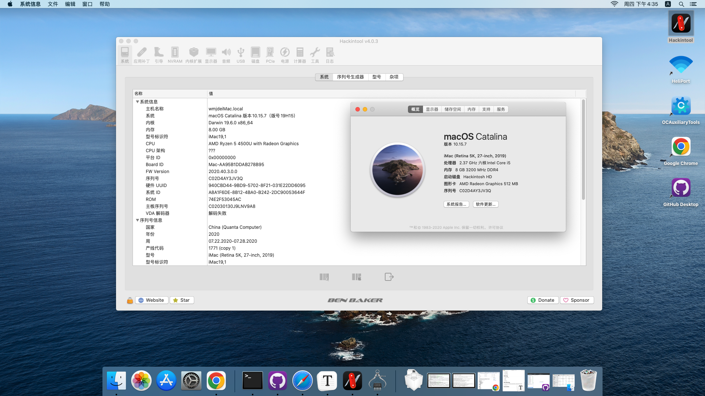

# HACKINTOSH-ASUS-PN50
Hackintosh for Asus PN50 Mini PC.

## Hardware

- ASUS PN50 Mini PC
- AMD Ryzen 7 4500U
- 8GB Memory
- AMD Vega 8 Graphics

## Version

10.15 Catalina

## Kexts

- AirportItlwm / Itlwm
- AppleALC
- IntelBluetooth
- AMDRyzenCPUPowerManagement
- Lilu
- NVMeFix
- RealtekRTL8111
- VirtualSMC
- NootedRed
- USB Toolbox

## Working

- Graphics (QE/CI)
- USB
- Wi-Fi
- Ethernet

## Not Working

- Poweroff / Reboot **(WILL HANG AFTER ALL APPLICATIONS EXITED)**
- System hang sometimes on Safari/Chrome.
- Up to test.

## Screenshot

